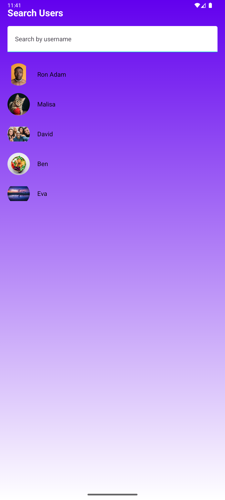

# **Connectify - Minimalist Social Media Application**

Connectify is a minimalist social media application designed to reduce excessive social media interaction while providing essential features for staying connected. The app encourages meaningful interactions and promotes a distraction-free environment.

---

## **Features**

- **Welcome Screen**: 
  - A clean and intuitive landing screen with options to Sign In or Sign Up.
  
- **Sign In and Sign Up**: 
  - Secure and user-friendly authentication screens to create or access your account.

- **Home Screen**:
  - A centralized hub to explore recent posts and navigate to key features such as:
    - Creating posts
    - Viewing your profile
    - Accessing settings
    - Searching for other users

- **Search Users**:
  - Quickly find and interact with other users.

- **Messaging**:
  - A simple and clean chat interface to connect with friends without distractions.
  - User profile pictures displayed for both sender and receiver.

- **Profile Screen**:
  - View and manage your personal profile with basic details.

- **Create Post**:
  - Share your thoughts and media in a simplified post creation interface.

- **Settings**:
  - Customize your app preferences and manage your account settings.

---

## **Technology Stack**

- **Programming Language**: Kotlin
- **UI Framework**: Jetpack Compose
- **Navigation**: Jetpack Navigation Component
- **Build System**: Gradle
- **Design Principles**: Material Design 3 (Material You)
- **IDE**: Android Studio

---

## **Setup Instructions**

### Prerequisites

1. **Android Studio**: Download and install the latest version of [Android Studio](https://developer.android.com/studio).
2. **Java Development Kit (JDK)**: Ensure you have JDK 11 or higher installed.
3. **Gradle**: Android Studio manages Gradle automatically, but ensure it is up to date.

### Steps to Build and Run the App

1. Clone this repository:
   ```bash
   git clone https://github.com/https://github.com/CodeRreaper69/Connectify_Minimalist_Social_Media_Application.git
   cd connectify
   ```

2. Open the project in Android Studio:
   - File > Open > Navigate to the `Connectify_Minimalist_Social_Media_Application` folder > Open.

3. Sync the project with Gradle files:
   - Click on "Sync Project with Gradle Files" in the top-right corner.

4. Build the project:
   - Click **Build** > **Build Bundle(s)/APK(s)** > **Build APK(s)**.

5. Run the app:
   - Connect an Android device or start an emulator.
   - Click the **Run** button in Android Studio.

6. Install the APK:
   - Locate the APK in `essentials` and install it on your device.
   - [Connectify_Download](essentials/Connectify.apk)

---

## **App Screenshots**

Here’s the updated **Screenshots Section** for your README that includes the new images from the `essentials` folder in your GitHub repository:

---

## **App Screenshots**

| **Screen**         | **Preview**                                                                 |
|---------------------|----------------------------------------------------------------------------|
| **Welcome Screen**  |    |
| **Sign In Screen**  |         |
| **Sign Up Screen**  |         |
| **Home Screen**     |             |
| **Create Post**     | |
| **Profile Screen**  |       |
| **Search Users**    | |
| **Message Screen**  | |
| **Settings Screen** |     |

---

### **How to Add Screenshots**
To add more screenshots or update existing ones:
1. Place the image files in the `essentials` folder in your repository.
2. Update the file paths in this README to reflect the changes.

---

## **Why Connectify?**

Modern social media platforms can overwhelm users with excessive notifications, infinite scrolling, and irrelevant content. **Connectify** is designed to:
- Simplify social interactions.
- Promote intentional engagement.
- Reduce time spent mindlessly scrolling.

---

## **Future Enhancements**

- Add support for backend services (e.g., Firebase or REST APIs).
- Implement push notifications for messaging and updates.
- Allow users to customize their profile pictures and bios.
- Enable likes and comments on posts.
- Introduce themes and accessibility options.

---


## **License**

This project is licensed under the MIT License. See the [LICENSE](LICENSE) file for details.

---

## **Contact**

For any questions, feedback, or feature requests, feel free to reach out:
- Email: [Sourabh Dey](deysourabh8981@gmail.com)
- GitHub: [CodeRreaper69](https://github.com/CodeRreaper69))
